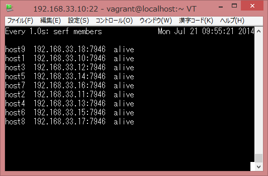
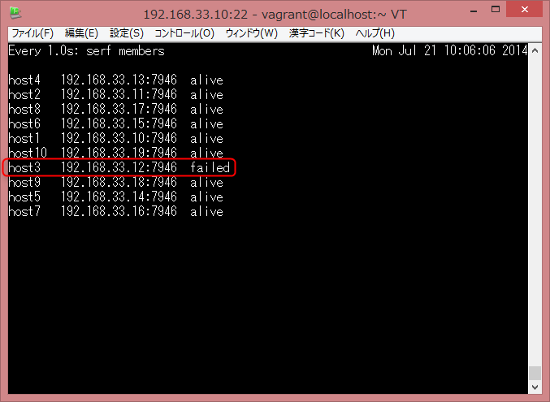
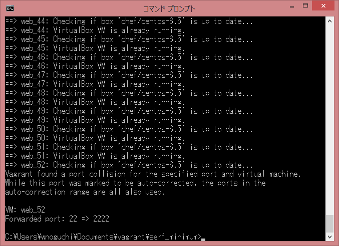
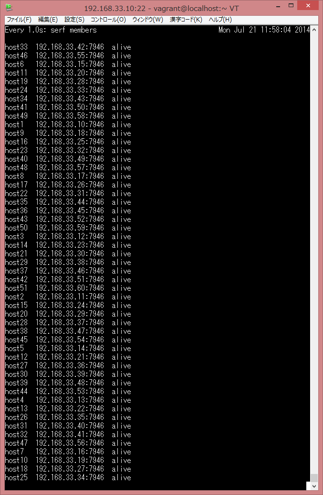

hbstudy#60
============

第60回： SerfとConsulでシステム運用を楽しくしよう！
---------------------------------------------------

### 参加前

~~繰り上がるつもり・・・！！~~


繰り上がりきたああああああ！（7/17）

### 概要

- 2014/07/20(日)
- 東京都東京都新宿区西新宿1-5-11 新宿三葉ビル6F

- [hbstudy#60 - connpass](http://connpass.com/event/7322/)
- [hbstudy#60 懇親会 - connpass](http://connpass.com/event/7323/)
- ハッシュタグ: [#hbstudy](https://twitter.com/search?q=%23hbstudy&src=typd)

hbstudyの趣旨についてですが、インフラエンジニアの勉強会です。

- [インフラエンジニア勉強会hbstudyについて](http://www.slideshare.net/toshiak_netmark/bbstudy?from=ss_embed)

世の中のエンジニアは開発と運用とを掛け持ちされている方も多いかと思われます。  
ネットワーク機器のコンフィグをいじることはなくてもLinux系、Windows Server系に限らず  
サーバの設定やアプリケーションのデプロイ作業等はやったことがある方は結構多いと思います。  
Webエンジニアであるからこそ、密接に関わるインフラに対する興味も尽きないわけで、その理解を深めるためにも参加してまいりました。

会場到着（開始前）
-------------------

会場に到着すると会場の設営はほとんど済んでいるようでした。  
参加費1,000円を渡すと首から下げるIDカードを貰いました。


さすがに百何十人収容できる会議室は広い。
Wi-Fiはこの段階ではつながらないようだったため、ちょっとテザリングで対応しました。
（のちほどつながるようになりました）

勉強会が始まる段になると、株式会社ハートビーツの馬場さんが司会をつとめてくださいました。

SerfとConsulで運用を楽しくしよう！
----------------------------------

- 最近注目されているSerfとConsulの話と、活用して運用を楽しくしたいね！という話をしていただきます
- 前佛 雅人さん
- [前佛 雅人(M.Zembutsu) (zembutsu)さんはTwitterを使っています](https://twitter.com/zembutsu)

いろいろとパロディを交えて楽しく講演をしていただきました。

### Serfについて

[Serf](http://www.serfdom.io/)

軽量なオーケストレーションツールとのことです。

スクリーンにはVirtualBoxのインスタンスを3台動かしている様子が映され、
Serfのクラスタが構成するデモをが行われました。

- バイナリ1個あれば動く
- コマンド1個叩くだけで動く

同期してserf membersで表示される情報は

- ホスト名
- IPアドレス
- ポート
- alive, left 等のステータス

**情報がすぐに同期される** のがポイントらしいです。

- クラスタが10台でも100台でもすぐに同期できる。

ということがわかっていればもう ~~帰宅~~ 寝ていても大丈夫とのことです。
（そんなことあない！）

- [ご注文は監視自動化ですか？](http://www.slideshare.net/zembutsu/is-the-order-an-automation-of-operation-and-monitoring)
- [Consulを使ってみた | Pocketstudio.jp log3](http://pocketstudio.jp/log3/2014/04/18/what_is_consul/)
- [Serf2Excel - Serf を実運用に活かす話 + Consul もあるよ](http://www.slideshare.net/zembutsu/serf-to-excel-and-consul-qpstudy)

資料を作るときは自動保存するようにしましょうねと注意が促されました。  
確かに、苦労して作成したデータが保存されていなかったということはよくあると思います。

最近は新しい技術をキャッチアップしていくのが結構大変ですね。
Dockerとか流行っています。

Docker Meetup Tokyo行ってみたかったです。

Dockerの講演でも使用されたスライドだそうですが、
今回はバージョン1.02だそうです。

頭の悪い資料を作成することで有名とのことですが、そんなことはありません。

ここで、農業の話になり、ラックのようなところでレタスが栽培されているスライドが映しだされました。

ここで、 **ラックマウントレタス** という造語を思いついた方は少なく無いと思います。

農業でやるとでやるとものすごい初期投資がかかるが、この業界でも監視自動化とかやろうと思えばすぐに試すことができる。


### Docker

- Docker control group
- namespace
- aufs

まずはオーケストレーションツールを使ってみる

- Dockerはエコシステム
- Eucalyptus Confでしゃべったことがあるそうです。

自動化は

- オーケストレーション
- 機械化

を包含する物

Fun（楽しい）とEasy（楽）は近づけることができる。

- 一斉に処理する
- 注意として、SerfとConsulはオーケストレーションのところしかしてくれない。

制御的な意味合いかな、ミドルウェアの設定はChef等でやる必要があると。  
ごめんなさい、間違っていたら指摘をお願いします。

### Serf

- ノードの同期が数秒単位
- タグ機能（Web、開発）
- 障害、フェイルオーバ情報の同期
- wgetでバイナリ1個とってくるだけで動作
- 多くのプラットフォームで動作
- HoshiCorpの方が作ったOSSプロダクト

Serfには以下の機能があるそうです。

- メンバ管理
- 障害検知
- カスタムイベント

- イベントをトリガとして動作する
- シェルで動くものならなんでも実行できる
- クラスタ参加・離脱

- 参加したら監視システムに設定を投入するとか
- 離脱したらLBから切り離すとか

### メンバ管理

タグごとにグループ処理できる

### さて

AとBがある

AからBにserf joinで両方を認識する

これでクラスタが構成される。

Cが参加したいとき

- CがAに参加した
- AがCに応答する
- BもMemberjoinを受け取る
- 以降はランダムに死活監視
- SPOFがない

### Bが突然の死

1. 死んだのを認識
1. それでもA, Cは定期的にBをチェックするが
1. こいつだめだと思われたら容赦なく外す

- 多数決論理ではない
- NICの死に方によってはフラッピングするかもしれない

### イベントが同期される

- 参加・離脱
- 伝搬速度はSerfのサイトでシミュレーションできる
- 理論値で1秒で95%が、2秒で100%（[Convergence Simulator - Serf](http://www.serfdom.io/docs/internals/simulator.html)）

### 運用例

- WebとLB
- ChefとPuppetとは違う。混同しないこと。
- メンバーの管理、イベントの発行
- serf agentコマンドだけで立ち上がる

### イベントハンドラ

- イベントに応じていろんなコマンドを実行する
- 起動オプションをjsonファイルにまとめられる

→日々の運用管理を楽にしてくれる

### LVSに応用する

- 致命的な問題がある
- ノード自身が停止は分かる
- サービスの停止はわからない

### そこでConsulですよ

- **サービス検出**
- 障害検知
- Nagiosプラグインみたいな方法で検出する
- HTTP APIまたはDNSで結果を返すことができる
- Zabbixの監視項目を動的化とかね

これらを応用すると

AWSみたいにOpenStackの上でオートスケールとかできるんじゃないでしょうか（聞き取り間違ってたらゴメンナサイ）

- Web UI
- HTTP API
- ローカルのDNSと連携することができる
- .internal
- Consulは開発途上です
- Webサーバのダウンをトリガとして一斉にコマンドを実行するなど

### 質疑応答

#### Q. なんでノード指定してjoinしてるのですか？

A. マルチキャストDNSに対応している環境であれば参加先のノード名を指定する必要はない。
今回のデモもdiscoverオプションでやっています。

Consul

サービスが消えるとクライアント自身が検出してサーバに送りつける
envconsul
Helokuもどきをつくれる
Qiita上にもいくつか投稿したかも

- 軽量でシンプル
- こんな複雑じゃないツールってなかったよね！！

たしかにPacemakerやHeartbeatでHAクラスタ構成する実験しようとしてWebサーバのHAクラスタ構成するだけでものすごい苦労した記憶あります。  
私のスキルセットが足りないのが大きな一因なのかもしれませんが・・・。

### 実践Zabbix

- Zabbixの管理の自動化
- 興味があったら見てね〜
- ZabbixにはAPIがある

cactiはもうオワコンなのだろうか。  
たしかにGUIめんどくさい。  
グラフ系はZabbixよく聞くようになったなあ・・・。

**楽しいと楽をつなげるようなことができればいいな。**

Google Group
オーケストレーションの部屋

を用意しました（します）とのことです。

休憩入ります～15:10
--------------------

130人以上が一斉につなぐとWi-Fi重っ！

「consulについて」
-------------------

- HashiCorpの新しいOSSプロダクトConsulの紹介と簡単な応用事例等。
- Michael H. Oshitaさん
- [Michael H. Oshita (ijin)さんはTwitterを使っています](https://twitter.com/ijin)

[Consul - HashiCorp](http://www.hashicorp.com/blog/consul.html)

替わりましてijinさんの公演となりました。

- [ConsulによるMySQLフェールオーバー - @ijin](http://ijin.github.io/blog/2014/07/11/mysql-failover-with-consul/)

### Consulについてもっと詳しく

- 10年ぐらい日本住んでらっしゃる
- 本名マイケルさん
- トラブル☆しゅーたーず という障害対応の勉強会をやります（8/9）

懇親会にも参加しましたがijinさんとよく呼ばれていらっしゃるのでしょうか。  
懇親会でもお話を聞くとAWSにものすごく詳しいそうです。  
うおおおすごい。

HashiCorpの4つめのプロダクト Consul

1. Vagrant
1. Packer
1. Serf
1. Consul

### 特徴

- 分散型クラスタ
- 簡単にサービス登録

画期的なのは

- DNSまたはHTTPでできること
- 複数のデータセンタをまたぐ
- KVS（動的な設定情報の置き場所として使っている）

構成要素は

- Consensus Protocol
- Gossip Protocol
- Sessions(Chuby)
- TLS Jespen Testing

### アーキテクチャ

エージェントをそれぞれのサーバに入れてサーバモード、またはクライアントモードで動作させる。

#### サーバモード

- ピアセット
- その中でleaderを決める
- トランザクション
- 通信はゴシッププロトコルで

### CONSISTENCY

- CAPの定理
- raftというものを使用している
- トランザクションのクエリはリーダノードにいってwrite
- スレーブにレプリケート

- 半分以上に行ったらコミット成功とみなす
- quorumにならないとコミットとみなさない

- ネットワークの分断テストはどうするのか
  - JEPSEN TESTINGでシミュレーションしている

### Consul agent

- foo
- bar
- baz

DNS, HTTPで設定

- タグservice[redis]
- タグservice[01.web]
- タグservice[02.web]

```bash
dig @localhost -p8600 bar.node.consul
```

```
01.web.service.consul
```

- serviceでグルーピングすると複数のIPがかえってくる
- v0.2まではTTLはデフォルトで0
- 以降はキャッシュできるようになった

### key/value endpoint

```
/v1/kv/<key>
```

- RESTful
- GET, PUT, DESTROY

#### kv

- ここでもjqコマンドが使われている
- base64でエンコード
- 生表示は `?raw` をつける

### catalog

### health

- ヘルスチェック
- このへんはjsonで定義する
- exitコードはnagiosっぽく
- 内部DNSとして使用できる

### ここでデモ

こちらのデモはグッときました。

- Ansible: オーケストレーションフレームワーク（構成管理ツールでChef, Puppetの親戚。Pythonで書かれている）
- インベントリマネージメント

Ansibleの場合は

- staticなhostsファイルに対してpingを打つなど
- サーバの台数が増えてくるとつらい
- Ansibleにはダイナミックインベントリという機能がある

- MySQLのレプリケーションしているとき
- マスタが死んだとき
- MHA
- 一番バイナリログが進んでいる奴に対して

- VIPを変える
- DNSでカタログのDNSを変更する

↓

- Consulでうまく連携する方法思いついたのでデモ

DNS引いて得られるIPが変わってスレーブがマスタに昇格する様子が映し出されます。

### ベンチマーク

#### GET

0.2.0→0.3.0のバージョンアップで

- TTLキャッシュで5倍ぐらいに向上した
- consistensy

PUTについても改善。

consul-apiはGo言語で書かれている。

**consulイイよ！**

#### おしらせ

- 8/9とらぶるしゅーたずきてね
- 今日この中にさくらのクラウドの横田さんがいます！
- SerfとConsulをやった結果をブログでアップしてください！

とのことでした。

以前さくらのクラウドのAPIをcurlで叩いて操作して、結果をjqで整形して見るようなエントリを書いて、  
横田さんにリツイートしてもらったのですが、是非一度お目にかかりたかったのでご挨拶してまいりました。  
恐れ多くもさくらのクラウドのクーポン券を頂戴いたしました。  
大切に使わせていただこうと思います。  
横田さんありがとうございます！


懇親会
--------

一次会、二次会にまで参加してまいりました。  
一応以前はインフラもちょっとは触っていましたが、  
私とは比較にならないほどすごくレベルの高いインフラエンジニアの方々ばかりでした。  
私は現在、Web系のシステム開発寄りのお仕事をしているのですが、  
インフラエンジニアの方々の現場の生の声がいろいろ聞けてとても面白かったです。


一人大反省会
--------------

ちょっといろんな運用自動化系の知識が曖昧だったので整理が必要だなと感じました。  
今日だけで言葉だけ聞いたことがあるミドルウェアやインフラ基盤用語がいくつもでてきました。

1. Serf: オーケストレーションツール
1. Consul: オーケストレーションツール
1. Ansible: Pythonで書かれた構成管理ツール（Chefの親戚）
1. Fabric: Python製のデプロイツール。Capistranoでやっとピンときた。 
1. Sensu: Nagiosを現代化した版。みんなSensu, Sensuって言ってたのでなんだろうと思ってたら、監視ツールのトレンドはNagiosではなくSensuなのか！Icingaは前に検討したことあったけど、あんまりはやってないのかな。
1. SoftLayer: 懇親会の席ではデータセンターのクラウド版と言われて理解できなかったのですが、調べてみたら物理サーバーやネットワークの引き回しのレベルでいじれるようにしたクラウドプラットフォームなんだろうか？

1. [監視ソフトをNagiosからSensuに切り替えて2ヶ月経ったのでまとめた - Glide Note - グライドノート](http://blog.glidenote.com/blog/2013/11/26/sensu/)
1. [chef - 次世代監視ツール Sensu リファレンス - Qiita](http://qiita.com/spesnova/items/f9a8c9661861cc453ead)
1. [Home - Icinga: Open Source Monitoring](https://www.icinga.org/)
1. [IBMの新しい高性能クラウド「SoftLayer」を使ってみた　～アカウント開設からインスタンス立ち上げまで （1/4）：CodeZine](http://codezine.jp/article/detail/7613)

やってみた（次の日）
----------------------

「SerfとConsulをやってみた結果をブログでアップしてくださいねー！」とのことでしたので、やってみました。  
今回は自分のデスクトップマシンで実験してみようと思います。

僕のデスクトップPCは無駄に性能がいいです。  
Core i7に実装メモリ32GB。  
ディスプレイは最低2枚ないと生きていけないですね・・・。  
最近グラボの調子が悪くて、引っ越してきてから上手く動かないんです。  
これがあればディスプレイ4台まではいけるんだけど・・・。  
電源の容量足りないのかな・・・？  
しかたないからオンボードでデュアルしてます。

という話は置いておいて、こういうことやってるから私はあまりお金がないので、
この無駄に性能のいいマシンで serf のクラスタを構成してみたいと思います。

### 数の暴力

とりあえず、私はそこまで頭が良くないので Serf のクラスタリングのさわりだけやってみます。

32GBの実装メモリがあるので、これを可能な限り活用してみようと思います。  
とりあえず必要最小限のアプリだけ立ち上げてメモリの使用量を減らしまくります。


1インスタンス512MBの割り当てとして立ち上げた場合

```
(29 - 2) * 1000 / 512 = 52
```

52台分の仮想マシンが構成できます。

もっと頑張れば

```
(29 - 0.5) * 1000 / 512 ≒ 56
```

いける。

### まずは2台でやってみた

50台近くも立てる予定なので、こんなのVagrant使わないとやってられないのでこの段階からVagrantを使います。  
まずは2台。

```
C:\Users\wnoguchi\Documents\vagrant\serf>vagrant init chef/centos-6.5
A `Vagrantfile` has been placed in this directory. You are now
ready to `vagrant up` your first virtual environment! Please read
the comments in the Vagrantfile as well as documentation on
`vagrantup.com` for more information on using Vagrant.
```

#### Vagrantfile抜粋

```ruby
# -*- mode: ruby -*-
# vi: set ft=ruby :

# Vagrantfile API/syntax version. Don't touch unless you know what you're doing!
VAGRANTFILE_API_VERSION = "2"

Vagrant.configure(VAGRANTFILE_API_VERSION) do |config|

  # Every Vagrant virtual environment requires a box to build off of.
  config.vm.box = "chef/centos-6.5"

  config.vm.provider "virtualbox" do |vb|
    vb.customize ["modifyvm", :id, "--memory", "1024"]
  end

  config.vm.define "web_1" do |instance|
    instance.vm.network :private_network, ip: "192.168.33.10"
  end

  config.vm.define "web_2" do |instance|
    instance.vm.network :private_network, ip: "192.168.33.11"
  end

end
```

#### 仮想マシン2台立ち上げ

```
C:\Users\wnoguchi\Documents\vagrant\serf_minimum>vagrant up
Bringing machine 'web_1' up with 'virtualbox' provider...
Bringing machine 'web_2' up with 'virtualbox' provider...
==> web_1: Box 'chef/centos-6.5' could not be found. Attempting to find and install...
    web_1: Box Provider: virtualbox
    web_1: Box Version: >= 0
==> web_1: Loading metadata for box 'chef/centos-6.5'
    web_1: URL: https://vagrantcloud.com/chef/centos-6.5
==> web_1: Adding box 'chef/centos-6.5' (v1.0.0) for provider: virtualbox
    web_1: Downloading: https://vagrantcloud.com/chef/centos-6.5/version/1/provider/virtualbox.box
    web_1: Progress: 100% (Rate: 5908k/s, Estimated time remaining: --:--:--)
==> web_1: Successfully added box 'chef/centos-6.5' (v1.0.0) for 'virtualbox'!
==> web_1: Importing base box 'chef/centos-6.5'...
==> web_1: Matching MAC address for NAT networking...
==> web_1: Checking if box 'chef/centos-6.5' is up to date...
==> web_1: Setting the name of the VM: serf_minimum_web_1_1405924483325_20292
==> web_1: Clearing any previously set network interfaces...
==> web_1: Preparing network interfaces based on configuration...
    web_1: Adapter 1: nat
    web_1: Adapter 2: hostonly
==> web_1: Forwarding ports...
    web_1: 22 => 2222 (adapter 1)
==> web_1: Running 'pre-boot' VM customizations...
==> web_1: Booting VM...
==> web_1: Waiting for machine to boot. This may take a few minutes...
    web_1: SSH address: 127.0.0.1:2222
    web_1: SSH username: vagrant
    web_1: SSH auth method: private key
    web_1: Warning: Connection timeout. Retrying...
==> web_1: Machine booted and ready!
==> web_1: Checking for guest additions in VM...
==> web_1: Configuring and enabling network interfaces...
==> web_1: Mounting shared folders...
    web_1: /vagrant => C:/Users/wnoguchi/Documents/vagrant/serf_minimum
==> web_2: Box 'chef/centos-6.5' could not be found. Attempting to find and install...
    web_2: Box Provider: virtualbox
    web_2: Box Version: >= 0
==> web_2: Loading metadata for box 'chef/centos-6.5'
    web_2: URL: https://vagrantcloud.com/chef/centos-6.5
==> web_2: Adding box 'chef/centos-6.5' (v1.0.0) for provider: virtualbox
==> web_2: Importing base box 'chef/centos-6.5'...
==> web_2: Matching MAC address for NAT networking...
==> web_2: Checking if box 'chef/centos-6.5' is up to date...
==> web_2: Setting the name of the VM: serf_minimum_web_2_1405924553780_11101
==> web_2: Fixed port collision for 22 => 2222. Now on port 2200.
==> web_2: Clearing any previously set network interfaces...
==> web_2: Preparing network interfaces based on configuration...
    web_2: Adapter 1: nat
    web_2: Adapter 2: hostonly
==> web_2: Forwarding ports...
    web_2: 22 => 2200 (adapter 1)
==> web_2: Running 'pre-boot' VM customizations...
==> web_2: Booting VM...
==> web_2: Waiting for machine to boot. This may take a few minutes...
    web_2: SSH address: 127.0.0.1:2200
    web_2: SSH username: vagrant
    web_2: SSH auth method: private key
    web_2: Warning: Connection timeout. Retrying...
==> web_2: Machine booted and ready!
==> web_2: Checking for guest additions in VM...
==> web_2: Configuring and enabling network interfaces...
==> web_2: Mounting shared folders...
    web_2: /vagrant => C:/Users/wnoguchi/Documents/vagrant/serf_minimum
```

#### Serfのインストール

```bash
$ wget https://dl.bintray.com/mitchellh/serf/0.6.3_linux_amd64.zip
Cannot write to “(snip)” (File name too long).
```

名前長すぎ！！って怒られてしまった。  
また、このboxイメージだとunzipコマンドが入っていないっぽいのでインストール。

```bash
sudo yum -y install unzip
```

もとい、

```bash
wget -O 0.6.3_linux_amd64.zip https://dl.bintray.com/mitchellh/serf/0.6.3_linux_amd64.zip
unzip 0.6.3_linux_amd64.zip
sudo mv serf /usr/local/bin/
```

バージョンを確認する。

```
[vagrant@localhost ~]$ serf version
Serf v0.6.3
Agent Protocol: 4 (Understands back to: 2)
```

#### Serfエージェントを立ち上げる

`&` バックグランドジョブにしないとプロンプトが帰ってこないから注意。

* host1にて

```
serf agent -node=host1 &
```

* host2にて

```
serf agent -node=host2 &
```

#### クラスタに加わる

mDNS(Multicast DNS)が有効かどうかはわからないので（このへん初心者）、
`serf join` コマンドからとりあえず入門してみることにした。

* host1にて

```
[vagrant@localhost ~]$ serf members
    2014/07/21 07:04:28 [INFO] agent.ipc: Accepted client: 127.0.0.1:56604
host1  10.0.2.15:7946  alive
```

メンバは自分のみ。

* host2に加える

```
[vagrant@localhost ~]$ serf join host2
    2014/07/21 07:04:37 [INFO] agent.ipc: Accepted client: 127.0.0.1:56605
    2014/07/21 07:04:37 [INFO] agent: joining: [host2] replay: false
    2014/07/21 07:04:37 [WARN] memberlist: Failed to resolve host2: lookup host2: no such host
    2014/07/21 07:04:37 [WARN] agent: error joining: lookup host2: no such host
Error joining the cluster: lookup host2: no such host
```

あれ、エラー・・・。  
そうだよね、host1がhost2のIPアドレス知ってるわけないもんね・・・。  

* IP直指定でhost2に加える。

```
[vagrant@localhost ~]$ serf join 192.168.33.11
    2014/07/21 07:11:39 [INFO] agent.ipc: Accepted client: 127.0.0.1:56606
    2014/07/21 07:11:39 [INFO] agent: joining: [192.168.33.11] replay: false
    2014/07/21 07:11:39 [INFO] serf: EventMemberJoin: host2 10.0.2.15
    2014/07/21 07:11:39 [INFO] agent: joined: 1 nodes
Successfully joined cluster by contacting 1 nodes.
[vagrant@localhost ~]$     2014/07/21 07:11:40 [INFO] agent: Received event: member-join
    2014/07/21 07:11:41 [WARN] memberlist: Got ping for unexpected node 'host2'
    2014/07/21 07:11:42 [INFO] memberlist: Suspect host2 has failed, no acks received
    2014/07/21 07:11:43 [WARN] memberlist: Got ping for unexpected node 'host2'
    2014/07/21 07:11:44 [INFO] memberlist: Suspect host2 has failed, no acks received
    2014/07/21 07:11:44 [WARN] memberlist: Got ping for unexpected node 'host2'
    2014/07/21 07:11:45 [INFO] memberlist: Suspect host2 has failed, no acks received
    2014/07/21 07:11:46 [WARN] memberlist: Got ping for unexpected node 'host2'
    2014/07/21 07:11:47 [INFO] memberlist: Suspect host2 has failed, no acks received
    2014/07/21 07:11:47 [INFO] memberlist: Marking host2 as failed, suspect timeout reached
    2014/07/21 07:11:47 [INFO] serf: EventMemberFailed: host2 10.0.2.15
    2014/07/21 07:11:48 [INFO] agent: Received event: member-failed
```

うまくい・・・ったようにみえて最終的に失敗している。

* serf members の結果

host2との通信が失敗してる（`failed` となっている）。  
いったんハンドシェイクが成功して繋がらなくなったような感じ。

```
[vagrant@localhost ~]$ serf members
    2014/07/21 07:12:03 [INFO] agent.ipc: Accepted client: 127.0.0.1:56608
host1  10.0.2.15:7946  alive
host2  10.0.2.15:7946  failed
```

まてよ、と思い直す。
Vagrantfileでプライベートネットワークを構成するためにNIC追加してたんだ。
どのNICでリッスンしてるかわかんないと通信を確立していいIPアドレスもわからないんじゃないか。

改めてhost1, host2それぞれのNICの当たり方を確認してみる。

* host1

```
[vagrant@localhost ~]$ ip addr show
1: lo: <LOOPBACK,UP,LOWER_UP> mtu 16436 qdisc noqueue state UNKNOWN
    link/loopback 00:00:00:00:00:00 brd 00:00:00:00:00:00
    inet 127.0.0.1/8 scope host lo
    inet6 ::1/128 scope host
       valid_lft forever preferred_lft forever
2: eth0: <BROADCAST,MULTICAST,UP,LOWER_UP> mtu 1500 qdisc pfifo_fast state UP qlen 1000
    link/ether 08:00:27:ce:08:3d brd ff:ff:ff:ff:ff:ff
    inet 10.0.2.15/24 brd 10.0.2.255 scope global eth0
    inet6 fe80::a00:27ff:fece:83d/64 scope link
       valid_lft forever preferred_lft forever
3: eth1: <BROADCAST,MULTICAST,UP,LOWER_UP> mtu 1500 qdisc pfifo_fast state UP qlen 1000
    link/ether 08:00:27:5e:6e:58 brd ff:ff:ff:ff:ff:ff
    inet 192.168.33.10/24 brd 192.168.33.255 scope global eth1
    inet6 fe80::a00:27ff:fe5e:6e58/64 scope link
       valid_lft forever preferred_lft forever
```

* host2

```
[vagrant@localhost ~]$ ip addr show
1: lo: <LOOPBACK,UP,LOWER_UP> mtu 16436 qdisc noqueue state UNKNOWN
    link/loopback 00:00:00:00:00:00 brd 00:00:00:00:00:00
    inet 127.0.0.1/8 scope host lo
    inet6 ::1/128 scope host
       valid_lft forever preferred_lft forever
2: eth0: <BROADCAST,MULTICAST,UP,LOWER_UP> mtu 1500 qdisc pfifo_fast state UP qlen 1000
    link/ether 08:00:27:ce:08:3d brd ff:ff:ff:ff:ff:ff
    inet 10.0.2.15/24 brd 10.0.2.255 scope global eth0
    inet6 fe80::a00:27ff:fece:83d/64 scope link
       valid_lft forever preferred_lft forever
3: eth1: <BROADCAST,MULTICAST,UP,LOWER_UP> mtu 1500 qdisc pfifo_fast state UP qlen 1000
    link/ether 08:00:27:ba:62:c3 brd ff:ff:ff:ff:ff:ff
    inet 192.168.33.11/24 brd 192.168.33.255 scope global eth1
    inet6 fe80::a00:27ff:feba:62c3/64 scope link
       valid_lft forever preferred_lft forever
```

NIC3つついてるから eth0 のアドレスで通信を確立したらいいかどうか分かんなくて失敗したのかな。

#### NICを指定してSerfエージェントを立ち上げる

さて、仕切り直し。  
`fg` してCtrl-C でプロセス殺して以下の設定でエージェント再度起動。

* host1にて

```
serf agent -iface=eth1 -node=host1 &
```

* host2にて

```
serf agent -iface=eth1 -node=host2 &
```

#### serf joinしてみる

```
[vagrant@localhost ~]$ serf join 192.168.33.11
    2014/07/21 07:48:37 [INFO] agent.ipc: Accepted client: 127.0.0.1:56634
    2014/07/21 07:48:37 [INFO] agent: joining: [192.168.33.11] replay: false
    2014/07/21 07:48:37 [INFO] serf: EventMemberJoin: host2 192.168.33.11
    2014/07/21 07:48:37 [INFO] agent: joined: 1 nodes
Successfully joined cluster by contacting 1 nodes.
[vagrant@localhost ~]$     2014/07/21 07:48:38 [INFO] agent: Received event: member-join
```

今度は成功したみたいだ。

#### serf membersの結果

どっちもaliveと表示された。

```
[vagrant@localhost ~]$ serf members
    2014/07/21 07:48:44 [INFO] agent.ipc: Accepted client: 127.0.0.1:56636
host1  192.168.33.10:7946  alive
host2  192.168.33.11:7946  alive
```

* 試しにhost2 のSerfエージェントを殺す。

上品な方法でシャットダウンするようです。

```
[vagrant@localhost ~]$ fg
serf agent -iface=eth1 -node=host2
^C==> Caught signal: interrupt
==> Gracefully shutting down agent...
    2014/07/21 07:51:04 [INFO] agent: requesting graceful leave from Serf
    2014/07/21 07:51:05 [INFO] serf: EventMemberLeave: host2 192.168.33.11
    2014/07/21 07:51:05 [INFO] agent: requesting serf shutdown
    2014/07/21 07:51:05 [INFO] agent: shutdown complete
```

* host1側でメンバの一覧を確認。

`failed` ではなく `left` となっているところがポイントですね。

```
[vagrant@localhost ~]$ serf members
    2014/07/21 07:51:12 [INFO] agent.ipc: Accepted client: 127.0.0.1:56642
host2  192.168.33.11:7946  left
host1  192.168.33.10:7946  alive
```

#### Serfエージェントを立ち上げる（マルチキャストDNS）

50何台すべてにserf joinしてたらたまらないのでマルチキャストDNS版もためす。

* host1にて

```
serf agent -iface=eth1 -node=host1 -discover=webapp &
```

* host2にて

```
serf agent -iface=eth1 -node=host2 -discover=webapp &
```

#### ログの流れは次のような感じ

host1にてエージェントを立ち上げると

```
[vagrant@localhost ~]$ serf agent -iface=eth1 -node=host1 -discover=webapp &
[1] 2308
[vagrant@localhost ~]$ ==> Using interface 'eth1' address '192.168.33.10'
==> Starting Serf agent...
==> Starting Serf agent RPC...
==> Serf agent running!
         Node name: 'host1'
         Bind addr: '192.168.33.10:7946'
          RPC addr: '127.0.0.1:7373'
         Encrypted: false
          Snapshot: false
           Profile: lan
      mDNS cluster: webapp

==> Log data will now stream in as it occurs:

    2014/07/21 08:06:13 [INFO] agent: Serf agent starting
    2014/07/21 08:06:13 [INFO] serf: EventMemberJoin: host1 192.168.33.10
    2014/07/21 08:06:13 [INFO] agent: joining: [192.168.33.10:7946] replay: false
    2014/07/21 08:06:13 [INFO] agent: joined: 1 nodes
    2014/07/21 08:06:13 [INFO] agent.mdns: Joined 1 hosts
    2014/07/21 08:06:14 [INFO] agent: Received event: member-join
```

ついでhost2で立ち上げるとhost2側では以下の様なログが流れ、

```
[vagrant@localhost ~]$ ==> Using interface 'eth1' address '192.168.33.11'
==> Starting Serf agent...
==> Starting Serf agent RPC...
==> Serf agent running!
         Node name: 'host2'
         Bind addr: '192.168.33.11:7946'
          RPC addr: '127.0.0.1:7373'
         Encrypted: false
          Snapshot: false
           Profile: lan
      mDNS cluster: webapp

==> Log data will now stream in as it occurs:

    2014/07/21 08:07:11 [INFO] agent: Serf agent starting
    2014/07/21 08:07:11 [INFO] serf: EventMemberJoin: host2 192.168.33.11
    2014/07/21 08:07:11 [INFO] agent: joining: [192.168.33.11:7946 192.168.33.10:7946] replay: false
    2014/07/21 08:07:11 [INFO] serf: EventMemberJoin: host1 192.168.33.10
    2014/07/21 08:07:11 [INFO] agent: joined: 2 nodes
    2014/07/21 08:07:11 [INFO] agent.mdns: Joined 2 hosts
    2014/07/21 08:07:12 [INFO] agent: Received event: member-join
```

* host1側でも

```
    2014/07/21 08:07:11 [INFO] serf: EventMemberJoin: host2 192.168.33.11
    2014/07/21 08:07:12 [INFO] agent: Received event: member-join
    2014/07/21 08:07:13 [INFO] agent: joining: [192.168.33.11:7946] replay: false
    2014/07/21 08:07:13 [INFO] agent: joined: 1 nodes
    2014/07/21 08:07:13 [INFO] agent.mdns: Joined 1 hosts
```

という追加のログが流れる。

#### serf members の結果は

OK。

```
[vagrant@localhost ~]$ serf members
    2014/07/21 08:09:33 [INFO] agent.ipc: Accepted client: 127.0.0.1:35347
host2  192.168.33.11:7946  alive
host1  192.168.33.10:7946  alive
```

ここまででVMは要らなくなったので一括削除。

```
vagrant destroy -f
```

ここまでのSerfの使い方で参考にしたのは前佛さんの以下の記事です。

1. [Serf設定オプションまとめ | Pocketstudio.jp log3](http://pocketstudio.jp/log3/2014/03/29/serf_configuration_quick_guide/)
1. [【Serf】v0.2.0 へのバージョンアップと、変わった所を確認してみた | Pocketstudio.jp log3](http://pocketstudio.jp/log3/2013/11/02/serf-version-0-2-0/)
1. [ご注文は監視自動化ですか？](http://www.slideshare.net/zembutsu/is-the-order-an-automation-of-operation-and-monitoring?related=1)

Vagrant複数インスタンスを立ち上げるのに参考にしたのは以下、

1. [vagrantの複数インスタンスをたてて遊んでみる - わすれっぽいきみえ](http://kimikimi714.hatenablog.com/entry/2014/04/21/vagrant%E3%81%AE%E8%A4%87%E6%95%B0%E3%82%A4%E3%83%B3%E3%82%B9%E3%82%BF%E3%83%B3%E3%82%B9%E3%82%92%E3%81%9F%E3%81%A6%E3%81%A6%E9%81%8A%E3%82%93%E3%81%A7%E3%81%BF%E3%82%8B_%E3%81%9D%E3%81%AE1)
1. [study-vagrant/study4 at master · tmknom/study-vagrant](https://github.com/tmknom/study-vagrant/tree/master/study4)

### 今度は予めプロビジョニングした状態のSerfクラスタを構成する

これができるようになるまで何回も `vagrant destroy -f` でぶっこわしまくりました。

```ruby
# -*- mode: ruby -*-
# vi: set ft=ruby :

# Vagrantfile API/syntax version. Don't touch unless you know what you're doing!
VAGRANTFILE_API_VERSION = "2"

Vagrant.configure(VAGRANTFILE_API_VERSION) do |config|

  # Every Vagrant virtual environment requires a box to build off of.
  config.vm.box = "chef/centos-6.5"

  config.vm.provider "virtualbox" do |vb|
    vb.customize ["modifyvm", :id, "--memory", "1024"]
  end

  config.vm.define "web_1" do |instance|
    instance.vm.network :private_network, ip: "192.168.33.10"

    instance.vm.provision :shell do |shell|
      shell.inline = <<-EOS
        if [ ! `which unzip` ]; then sudo yum -y install unzip ;fi
        if [ ! `which serf` ]; then
          cd /tmp/
          wget -O 0.6.3_linux_amd64.zip https://dl.bintray.com/mitchellh/serf/0.6.3_linux_amd64.zip
          unzip 0.6.3_linux_amd64.zip
          sudo mv serf /usr/local/bin/
          nohup /usr/local/bin/serf agent -iface=eth1 -node=host1 -discover=webapp 0<&- &>/dev/null&
          cat <<EOF >>/etc/rc.d/rc.local
          /usr/local/bin/serf agent -iface=eth1 -node=host1 -discover=webapp &
EOF
        fi
      EOS
    end
    
  end

  config.vm.define "web_2" do |instance|
    instance.vm.network :private_network, ip: "192.168.33.11"

    instance.vm.provision :shell do |shell|
      shell.inline = <<-EOS
        if [ ! `which unzip` ]; then sudo yum -y install unzip ;fi
        if [ ! `which serf` ]; then
          cd /tmp/
          wget -O 0.6.3_linux_amd64.zip https://dl.bintray.com/mitchellh/serf/0.6.3_linux_amd64.zip
          unzip 0.6.3_linux_amd64.zip
          sudo mv serf /usr/local/bin/
          nohup /usr/local/bin/serf agent -iface=eth1 -node=host2 -discover=webapp 0<&- &>/dev/null&
          cat <<EOF >>/etc/rc.d/rc.local
          /usr/local/bin/serf agent -iface=eth1 -node=host2 -discover=webapp &
EOF
        fi
      EOS
    end
    
  end

end
```

1. [Linuxでのプロセスの管理(bg,fg,disown) - longicornの日記](http://d.hatena.ne.jp/longicorn/touch/20130201)
1. [Linuxコマンド集 - 【 nohup 】 ログアウトした後もコマンドを実行し続ける：ITpro](http://itpro.nikkeibp.co.jp/article/COLUMN/20060227/230850/)
1. [Shell provisioning fails to exit · Issue #1553 · mitchellh/vagrant](https://github.com/mitchellh/vagrant/issues/1553)

### Serfクラスタ10台を構成する

いきなり50台はなんかうまくいかなそうな気がするので、10台からやってみる。  
このままじゃプロビジョニングが美しくないのでRuby力を発揮する。

```ruby
# -*- mode: ruby -*-
# vi: set ft=ruby :

# Vagrantfile API/syntax version. Don't touch unless you know what you're doing!
VAGRANTFILE_API_VERSION = "2"

Vagrant.configure(VAGRANTFILE_API_VERSION) do |config|

  # Every Vagrant virtual environment requires a box to build off of.
  config.vm.box = "chef/centos-6.5"

  config.vm.provider "virtualbox" do |vb|
    vb.customize ["modifyvm", :id, "--memory", "1024"]
  end

  # Number of Virtual Machines
  NUMBER_OF_VMS = 10
  ip_addr_base = 10

  (1..NUMBER_OF_VMS).each do |host_index|

    define_name = "web_#{host_index}"
    hostname = "host#{host_index}"
    octet4 = ip_addr_base + host_index - 1

    config.vm.define define_name do |instance|
      instance.vm.network :private_network, ip: "192.168.33.#{octet4}"

      instance.vm.provision :shell do |shell|
        shell.inline = <<-EOS
          if [ ! `which unzip` ]; then sudo yum -y install unzip ;fi
          if [ ! `which serf` ]; then
            cd /tmp/
            wget -O 0.6.3_linux_amd64.zip https://dl.bintray.com/mitchellh/serf/0.6.3_linux_amd64.zip
            unzip 0.6.3_linux_amd64.zip
            sudo mv serf /usr/local/bin/
            nohup /usr/local/bin/serf agent -iface=eth1 -node=#{hostname} -discover=webapp 0<&- &>/dev/null&
            cat <<EOF >>/etc/rc.d/rc.local
            /usr/local/bin/serf agent -iface=eth1 -node=#{hostname} -discover=webapp &
EOF
          fi
        EOS
      end
      
    end
  end

end
```

このあたりになってくるとvagrant upコマンドがなかなか終わらないが、  
始めのころのVMは既にアクセス可能になっているはずなので、
そのノードに接続してwatchコマンドとかでserf membersの変化とかを確認すると
出来上がったインスタンスから次々にSerfのクラスタwebappクラスタに加わっていって結構面白いことになってる。

```bash
watch -n 1 serf members
```



冪等性も保証しているので、ひと通りメンバに加わったことがわかったらここで

```
vagrant reload
```

してみるのも面白い。

リロード中のVMはfailedのステータスになる。
さらに特定のVMだけを停止してみたり、


```
C:\Users\wnoguchi\Documents\vagrant\serf_minimum>vagrant halt web_3
==> web_3: Attempting graceful shutdown of VM...
```



一斉にとめて一斉に再起動するのもfailedがどんどん増えていくのでなかなかおつなものです。  
ただし接続している自分自身がシャットダウンされたら元も粉もないですけど。

```
C:\Users\wnoguchi\Documents\vagrant\serf_minimum>vagrant halt
==> web_10: Attempting graceful shutdown of VM...
==> web_9: Attempting graceful shutdown of VM...
==> web_8: Attempting graceful shutdown of VM...
==> web_7: Attempting graceful shutdown of VM...
==> web_6: Attempting graceful shutdown of VM...
==> web_5: Attempting graceful shutdown of VM...
==> web_4: Attempting graceful shutdown of VM...
==> web_2: Attempting graceful shutdown of VM...
==> web_1: Attempting graceful shutdown of VM...

C:\Users\wnoguchi\Documents\vagrant\serf_minimum>vagrant up
Bringing machine 'web_1' up with 'virtualbox' provider...
Bringing machine 'web_2' up with 'virtualbox' provider...
Bringing machine 'web_3' up with 'virtualbox' provider...
Bringing machine 'web_4' up with 'virtualbox' provider...
Bringing machine 'web_5' up with 'virtualbox' provider...
Bringing machine 'web_6' up with 'virtualbox' provider...
Bringing machine 'web_7' up with 'virtualbox' provider...
Bringing machine 'web_8' up with 'virtualbox' provider...
Bringing machine 'web_9' up with 'virtualbox' provider...
Bringing machine 'web_10' up with 'virtualbox' provider...
==> web_1: Checking if box 'chef/centos-6.5' is up to date...
==> web_1: Clearing any previously set forwarded ports...
```

### 52ノードクラスタへの挑戦

もはや定数定義を52にしてマシンパワーの限界に挑戦するような感じになってきました。

```ruby
# -*- mode: ruby -*-
# vi: set ft=ruby :

# Vagrantfile API/syntax version. Don't touch unless you know what you're doing!
VAGRANTFILE_API_VERSION = "2"

Vagrant.configure(VAGRANTFILE_API_VERSION) do |config|

  # Every Vagrant virtual environment requires a box to build off of.
  config.vm.box = "chef/centos-6.5"

  config.vm.provider "virtualbox" do |vb|
    vb.customize ["modifyvm", :id, "--memory", "1024"]
  end

  # Number of Virtual Machines
  NUMBER_OF_VMS = 52
  ip_addr_base = 10

  (1..NUMBER_OF_VMS).each do |host_index|

    define_name = "web_#{host_index}"
    hostname = "host#{host_index}"
    octet4 = ip_addr_base + host_index - 1

    config.vm.define define_name do |instance|
      instance.vm.network :private_network, ip: "192.168.33.#{octet4}"

      instance.vm.provision :shell do |shell|
        shell.inline = <<-EOS
          if [ ! `which unzip` ]; then sudo yum -y install unzip ;fi
          if [ ! `which serf` ]; then
            cd /tmp/
            wget -O 0.6.3_linux_amd64.zip https://dl.bintray.com/mitchellh/serf/0.6.3_linux_amd64.zip
            unzip 0.6.3_linux_amd64.zip
            sudo mv serf /usr/local/bin/
            nohup /usr/local/bin/serf agent -iface=eth1 -node=#{hostname} -discover=webapp 0<&- &>/dev/null&
            cat <<EOF >>/etc/rc.d/rc.local
            /usr/local/bin/serf agent -iface=eth1 -node=#{hostname} -discover=webapp &
EOF
          fi
        EOS
      end
      
    end
  end

end
```

あともうひと息だったのですが、フォワーディングするポートが衝突してしまい、息絶えました。



```
==> web_51:   inflating: serf
==> web_52: Importing base box 'chef/centos-6.5'...
==> web_52: Matching MAC address for NAT networking...
==> web_52: Checking if box 'chef/centos-6.5' is up to date...
==> web_52: Setting the name of the VM: serf_minimum_web_52_1405943316239_88578
Vagrant found a port collision for the specified port and virtual machine.
While this port was marked to be auto-corrected, the ports in the
auto-correction range are all also used.

VM: web_52
Forwarded port: 22 => 2222
```

少し書きなおしてみる。

```ruby
# -*- mode: ruby -*-
# vi: set ft=ruby :

# Vagrantfile API/syntax version. Don't touch unless you know what you're doing!
VAGRANTFILE_API_VERSION = "2"

Vagrant.configure(VAGRANTFILE_API_VERSION) do |config|

  # Every Vagrant virtual environment requires a box to build off of.
  config.vm.box = "chef/centos-6.5"

  config.vm.provider "virtualbox" do |vb|
    vb.customize ["modifyvm", :id, "--memory", "1024"]
  end

  # Number of Virtual Machines
  NUMBER_OF_VMS = 52
  ip_addr_base = 10

  (1..NUMBER_OF_VMS).each do |host_index|

    define_name = "web_#{host_index}"
    hostname = "host#{host_index}"
    octet4 = ip_addr_base + host_index - 1
    forwarding_port = 8080 + host_index - 1

    config.vm.define define_name do |instance|
      instance.vm.network :private_network, ip: "192.168.33.#{octet4}"
      instance.vm.network "forwarded_port", guest: 22, host: forwarding_port

      instance.vm.provision :shell do |shell|
        shell.inline = <<-EOS
          if [ ! `which unzip` ]; then sudo yum -y install unzip ;fi
          if [ ! `which serf` ]; then
            cd /tmp/
            wget -O 0.6.3_linux_amd64.zip https://dl.bintray.com/mitchellh/serf/0.6.3_linux_amd64.zip
            unzip 0.6.3_linux_amd64.zip
            sudo mv serf /usr/local/bin/
            nohup /usr/local/bin/serf agent -iface=eth1 -node=#{hostname} -discover=webapp 0<&- &>/dev/null&
            cat <<EOF >>/etc/rc.d/rc.local
            /usr/local/bin/serf agent -iface=eth1 -node=#{hostname} -discover=webapp &
EOF
          fi
        EOS
      end
      
    end
  end

end
```

今度はどうだろう。
ダメだった。

んー時間切れ。51ノードまでは確認できました。  
ポートフォワーディングのコンフリクトが直せればもっといけそうな感じ。



以上のVagrantfileは以下のGistからも取得可能です。

[第60回： SerfとConsulでシステム運用を楽しくしよう！http://connpass.com/event/7322/ : 今回の実験使用したVagrantfileの一覧](https://gist.github.com/wnoguchi/b784ca2b4c04cd0111f6)

### Consulは？

Consulについてはサービス管理の機能がDNS, HTTP APIでシンプルに提供されいてることが分かったのですが、  
私の理解力が追いついていないため、今回は検証までには至りませんでした・・・。

以上です、ありがとうございました！
