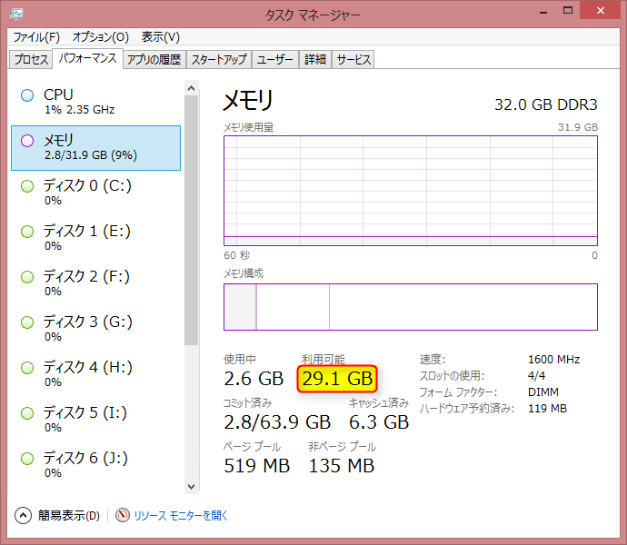

hbstudy#60
============

第60回： SerfとConsulでシステム運用を楽しくしよう！
---------------------------------------------------

### 参加前

~~繰り上がるつもり・・・！！~~


繰り上がりきたああああああ！（7/17）

### 概要

- 2014/07/20(日)
- 東京都東京都新宿区西新宿1-5-11 新宿三葉ビル6F

- [hbstudy#60 - connpass](http://connpass.com/event/7322/)
- [hbstudy#60 懇親会 - connpass](http://connpass.com/event/7323/)
- ハッシュタグ: [#hbstudy](https://twitter.com/search?q=%23hbstudy&src=typd)

#### hbstudyの趣旨について

- [インフラエンジニア勉強会hbstudyについて](http://www.slideshare.net/toshiak_netmark/bbstudy?from=ss_embed)

会場到着（開始前）
-------------------

HeartBeatsのババさんが司会


SerfとConsulで運用を楽しくしよう！
----------------------------------

- 最近注目されているSerfとConsulの話と、活用して運用を楽しくしたいね！という話をしていただきます
- 前佛 雅人さん
- [前佛 雅人(M.Zembutsu) (zembutsu)さんはTwitterを使っています](https://twitter.com/zembutsu)


serf

VirtualBoxのインスタンスを3台動かしている

バイナリ1個あれば動く

コマンド1個叩くだけで動く

3台のクラスタが構成される


ホスト名
IPアドレス
ポート
alive, left

情報がすぐに同期される


クラスタが10台でも100台でもできる

というオーケスてレーションツール


今日はネていても大丈夫

[ご注文は監視自動化ですか？](http://www.slideshare.net/zembutsu/is-the-order-an-automation-of-operation-and-monitoring)
[Consulを使ってみた | Pocketstudio.jp log3](http://pocketstudio.jp/log3/2014/04/18/what_is_consul/)
[Serf2Excel - Serf を実運用に活かす話 + Consul もあるよ](http://www.slideshare.net/zembutsu/serf-to-excel-and-consul-qpstudy)

資料を作るときは自動保存するときは


新しい技術

Dockerとか

今回はバージョン1.02


頭の悪い資料を作成することで有名・・・？

農業
ラックのようなところでレタスが売られている

ラックマウントレタス


農業でやるとでやるとものすごい初期投資がかかるが、
この業界でも監視自動化とか


オーケスてレーション

Docker


Docker control group
namespace
aufs


まずはオーケスてレーションツールを使ってみる


Dockerはエコシステム


Eucalyps Confでしゃべったことがある


コンテナと自動化


自動化は
オーケストレーション
と機械化
を包含する物


FunとEasyは


一斉に処理する


serfとconsulはオーケストレーションのところしかしてくれない


### serf

ノードの同期が数秒単位
タグ機能（Web、開発）

障害、フェイルオーバ情報の同期

wgetでバイナリ1個とってくるだけで動作

多くのプラットフォームで動作


HoshiCorpの方が作ったOSSプロダクト


メンバ管理
障害検知
カスタムイベント


イベントをトリガとして動作する
シェルで動くものならなんでも実行できる
クラスタ参加・離脱


参加したら監視システムに設定を投入するとか

離脱したらLBから切り離すとか


### メンバ管理

タグごとにグループ処理できる


#### さて

AとBがある

Aから
serf join
で両方を認識する

これでクラスタが構成される。

Cが参加したいとき

CがAに参加した
AがCに応答する
BもMemberjoinを受け取る


以降はランダムに死活監視


#### 

Bが突然の死

死んだのを認識
それでもA, Cは定期的にBをチェックするが
こいつだめだと思われたら容赦なく外す


多数決論理ではない

NICの死に方によっては
フラッピングするかもしれない


### イベントが同期される

参加・離脱

伝搬速度は
serfのサイトでシミュレーションできる
理論値で2病で100%
1秒で95%


運用例
webとLB

ChefとPuppetとは違う

メンバーの管理、イベントの発行


serf agentだけで立ち上がる


イベントハンドラ

イベントに応じていろんなコマンドを実行する

起動オプションをjsonファイルにまとめられる


→日々の運用管理を


### LVSに応用する

致命的な問題がある


ノード地震が停止は分かる


### COnsul


**サービス検出**
障害検知


nagiosプラグインみたいな方法で検出する

HTTP APIまたはDNSで結果を返すことができる


Zabbixの監視項目を動的化


これらを応用すると

AWSみたいに

OpenStackの上で
オートスケールとかできるんじゃないでしょうか


Web UI
curl

ローカルのDNSと連携することができる

.internal


consulは開発途上です


Webサーバのダウンをトリガとして一斉にコマンドを実行するなど


QA

なんでノード指定してjoinしてるの

マルチキャストDNSに対応している環境であれば
参加先のノード名を指定する必要はない

discoverオプション


####

consul

サービスが消えるとクライアント自身が検出してサーバに送りつける


envconsul

Helokuもどきをつくれる

qiita上にもいくつか投稿したかも


軽量でシンプル
こんな複雑じゃないツールってなかったよね！！


### 実践Zabbix

Zabbixの管理の自動化


興味があったら見てね〜〜〜〜〜〜〜〜〜〜


ZABBIXにはAPIがある


楽しいと楽をつなげるようなことができればいいな。


Google Group
オーケストレーションの部屋


[Serf](http://www.serfdom.io/)

[正月休みだし Serf 触ってみた - sonots:blog](http://blog.livedoor.jp/sonots/archives/35397486.html)


休憩～15:10
-----------

wifi重っ！

「consulについて」
-------------------

- HashiCorpの新しいOSSプロダクトconsulの紹介と簡単な応用事例等。
- Michael H. Oshitaさん
- [Michael H. Oshita (ijin)さんはTwitterを使っています](https://twitter.com/ijin)


[Consul - HashiCorp](http://www.hashicorp.com/blog/consul.html)


[ConsulによるMySQLフェールオーバー - @ijin](http://ijin.github.io/blog/2014/07/11/mysql-failover-with-consul/)


[Convergence Simulator - Serf](http://www.serfdom.io/docs/internals/simulator.html)

consulについてもっと詳しく

10年ぐらい日本住んでらっしゃる
本名マイケルさん

トラブル★しゅーたーず
という障害対応の勉強会

8/9


HashiCorp


4つめのプロダクト consul

Vagrant
Packer
serf
consul

分散型クラスタ


簡単にサービス登録


画期的なのは
DNSまたはHTTPでできること


複数のデータセンタをまたぐ
KVS（動的な設定情報の置き場所として使っている）


Consensus Protocol
Gossip Protocol
Sessions(Chuby)
TLS Jespen Testing


### アーキテクチャ

エージェントをそれぞれのサーバに入れて
サーバモード、またはクライアントモードで動作させる


#### サーバモード

ぴあセット

その中でleaderを決める
トランザクション


通有心はゴシッププロトコルで


### CONSISTENCY

CAPの定理

raftというものを使用している
トランザクションのクエリはリーダノードにいってwrite
スレーブにレプリケート

半分以上に行ったらコミット成功とみなす
quorumにならないとコミットとみなさない


ネットワークの分断テストはどうするのか


JEPSEN TESTINGでシミュレーションしている


### consul agent


foo


bar


baz


DNS,HTTPで設定

タグservice[redis]
タグservice[01.web]
タグservice[02.web]


dig @localhost -p8600 bar.node.consul


01.web.service.consul


serviceでグルーピングすると
複数のIPがかえってくる


v0.2まではTTLはデフォルトで0

以降はキャッシュできるようになった


key/value endpoint

/v1/kv/<key>

RESTful

GET,PUL,DESTROY


### kv

ここでもjqが使われている

base64でエンコード

?raw


### catalog


### health

ヘルスチェック

このへんはjsonで定義する

exitコードはnagiosっぽく


内部DNSとして使用できる


### ここでデモ

ansibleオーケストレーションフレームワーク


インベントリマネージメント

ansibleの場合は

staticなhostファイルに対してpingを打つなど

サーバの台数が増えてくるとつらい

ansibleにはダイナミックインベントリという機能がある


MySQLのレプリケーションしているとき
マスタが死んだとき

MHA

一番バイナリログが進んでいる奴に対して

VIPを変える
DNSでカタログのDNSを変更する

↓

Consulでうまく連携する方法思いついたのでデモ


### ベンチマーク

GET

0.2.0


0.3.0

TTLキャッシュで5倍ぐらいに向上した

consistensy


PUTについても改善


consul-apiはgoで書かれている


consulイイよ！


#### おしらせ

- 8/9とらぶるしゅーたずきてね
- 今日この中にさくらのクラウドの横田さんがいます！
- SerfとConsulをやった結果をブログでアップしてください！

とのことでした。

以前さくらのクラウドのAPIをcurlで叩いて操作して、結果をjqで整形して見るようなエントリを書いて、  
横田さんにリツイートしてもらったのですが、是非一度お目にかかりたかったのでご挨拶してまいりました。  
恐れ多くもさくらのクラウドのクーポン券を頂戴いたしました。  
大切に使わせていただこうと思います。  
横田さんありがとうございます！


懇親会
--------

一次会、二次会にまで参加してまいりました。  
一応以前はインフラもちょっとは触っていましたが、  
私とは比較にならないほどすごくレベルの高いインフラエンジニアの方々ばかりでした。  
私は現在、Web系のシステム開発寄りのお仕事をしているのですが、  
インフラエンジニアの方々の現場の生の声がいろいろ聞けてとても面白かったです。


一人大反省会
--------------

ちょっといろんな運用自動化系の知識が曖昧だったので整理が必要だなと感じました。  
今日だけで言葉だけ聞いたことがあるミドルウェアやインフラ基盤用語がいくつもでてきました。

1. Serf
1. Consul
1. Ansible
1. fabric
1. Sensu
1. SoftLayer

1. [IBMの新しい高性能クラウド「SoftLayer」を使ってみた　～アカウント開設からインスタンス立ち上げまで （1/4）：CodeZine](http://codezine.jp/article/detail/7613)
1. [監視ソフトをNagiosからSensuに切り替えて2ヶ月経ったのでまとめた - Glide Note - グライドノート](http://blog.glidenote.com/blog/2013/11/26/sensu/)
1. [chef - 次世代監視ツール Sensu リファレンス - Qiita](http://qiita.com/spesnova/items/f9a8c9661861cc453ead)


やってみた（次の日）
----------------------

「serfとconsulをやってみた結果をブログでアップしてくださいねー！」とのことでしたので、やってみました。  
今回は自分のデスクトップマシンで実験してみようと思います。

僕のデスクトップPCは無駄に性能がいいです。  
Core i7に実装メモリ32GB。  
ディスプレイは最低2枚ないと生きていけないですね・・・。  
最近グラボの調子が悪くて、引っ越してきてから上手く動かないんです。  
これがあればディスプレイ4台まではいけるんだけど・・・。  
電源の容量足りないのかな・・・？  
しかたないからオンボードでデュアルしてます。

という話は置いておいて、こういうことやってるから私はあまりお金がないので、
この無駄に性能のいいマシンで serf のクラスタを構成してみたいと思います。

### 数の暴力

とりあえず、私はそこまで頭が良くないので serf のクラスタリングのさわりだけやってみます。

32GBの実装メモリがあるので、これを可能な限り活用してみようと思います。  
とりあえず必要最小限のアプリだけ立ち上げてメモリの使用量を減らしまくります。



1インスタンス512MBの割り当てとして立ち上げた場合

```
(29 - 2) * 1000 / 512 = 52
```

52台分の仮想マシンが構成できます。

もっと頑張れば

```
(29 - 0.5) * 1000 / 512 ≒ 56
```

いける。

### やってみる

まずは設定

```
C:\Users\wnoguchi\Documents\vagrant\serf>vagrant init chef/centos-6.5
A `Vagrantfile` has been placed in this directory. You are now
ready to `vagrant up` your first virtual environment! Please read
the comments in the Vagrantfile as well as documentation on
`vagrantup.com` for more information on using Vagrant.
```

1. [vagrantの複数インスタンスをたてて遊んでみる - わすれっぽいきみえ](http://kimikimi714.hatenablog.com/entry/2014/04/21/vagrant%E3%81%AE%E8%A4%87%E6%95%B0%E3%82%A4%E3%83%B3%E3%82%B9%E3%82%BF%E3%83%B3%E3%82%B9%E3%82%92%E3%81%9F%E3%81%A6%E3%81%A6%E9%81%8A%E3%82%93%E3%81%A7%E3%81%BF%E3%82%8B_%E3%81%9D%E3%81%AE1)
1. [study-vagrant/study4 at master · tmknom/study-vagrant](https://github.com/tmknom/study-vagrant/tree/master/study4)
