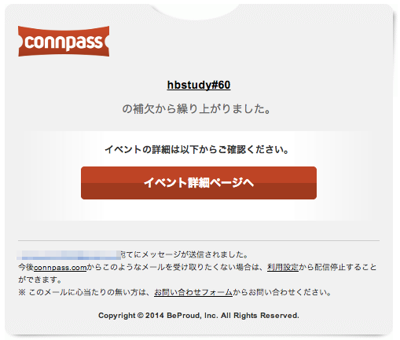

hbstudy#60
============

第60回： SerfとConsulでシステム運用を楽しくしよう！
---------------------------------------------------

### 参加前

~~繰り上がるつもり・・・！！~~

繰り上がりきたああああああ！（7/17）

### 概要

- 2014/07/20(日)
- 東京都東京都新宿区西新宿1-5-11 新宿三葉ビル6F

- [hbstudy#60 - connpass](http://connpass.com/event/7322/)
- [hbstudy#60 懇親会 - connpass](http://connpass.com/event/7323/)
- ハッシュタグ: [#hbstudy](https://twitter.com/search?q=%23hbstudy&src=typd)

#### hbstudyの趣旨について

- [インフラエンジニア勉強会hbstudyについて](http://www.slideshare.net/toshiak_netmark/bbstudy?from=ss_embed)

SerfとConsulで運用を楽しくしよう！
----------------------------------

- 最近注目されているSerfとConsulの話と、活用して運用を楽しくしたいね！という話をしていただきます
- 前佛 雅人さん
- [前佛 雅人(M.Zembutsu) (zembutsu)さんはTwitterを使っています](https://twitter.com/zembutsu)

「consulについて」
-------------------

- HashiCorpの新しいOSSプロダクトconsulの紹介と簡単な応用事例等。
- Michael H. Oshitaさん
- [Michael H. Oshita (ijin)さんはTwitterを使っています](https://twitter.com/ijin)
